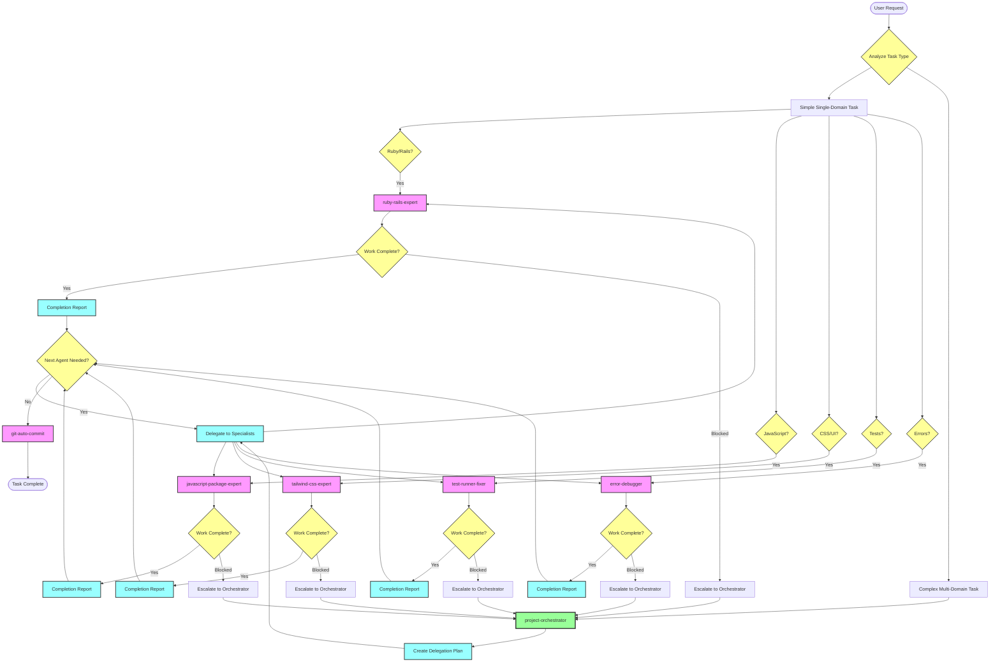
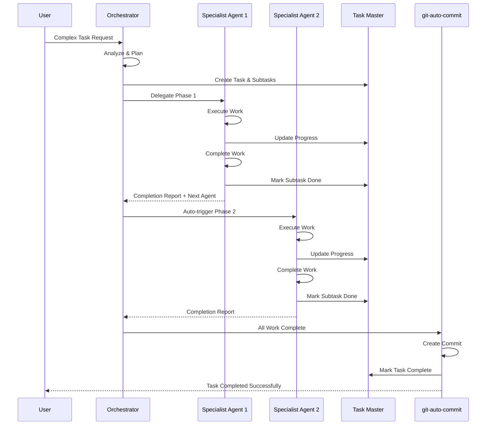
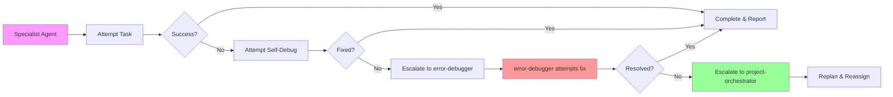
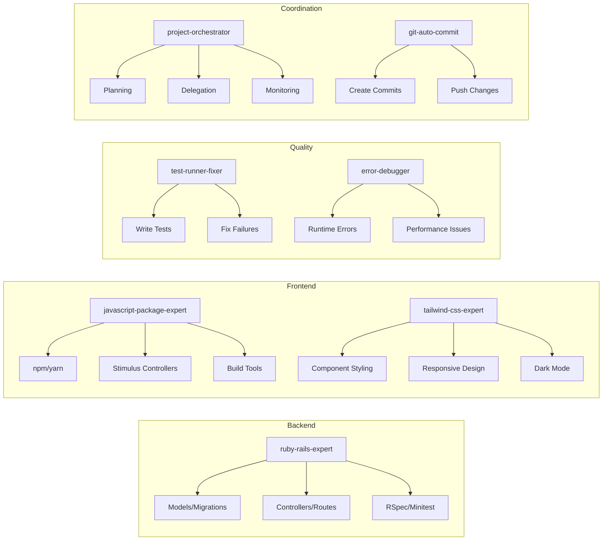

# Agent Workflow System

## Task Routing & Agent Orchestration

```mermaid
graph TB
    %% Entry Point
    Start([User Request]) --> Analyze{Analyze Task Type}
    
    %% Task Analysis & Routing
    Analyze --> Simple[Simple Single-Domain Task]
    Analyze --> Complex[Complex Multi-Domain Task]
    
    %% Simple Task Direct Routing
    Simple --> RubyCheck{Ruby/Rails?}
    Simple --> JSCheck{JavaScript?}
    Simple --> CSSCheck{CSS/UI?}
    Simple --> TestCheck{Tests?}
    Simple --> ErrorCheck{Errors?}
    
    %% Direct Agent Assignment
    RubyCheck -->|Yes| RubyAgent[ruby-rails-expert]
    JSCheck -->|Yes| JSAgent[javascript-package-expert]
    CSSCheck -->|Yes| CSSAgent[tailwind-css-expert]
    TestCheck -->|Yes| TestAgent[test-runner-fixer]
    ErrorCheck -->|Yes| ErrorAgent[error-debugger]
    
    %% Complex Task Orchestration
    Complex --> Orchestrator[project-orchestrator]
    
    %% Orchestrator Planning
    Orchestrator --> Plan[Create Delegation Plan]
    Plan --> Delegate[Delegate to Specialists]
    
    %% Delegation Paths
    Delegate --> RubyAgent
    Delegate --> JSAgent
    Delegate --> CSSAgent
    Delegate --> TestAgent
    Delegate --> ErrorAgent
    
    %% Agent Completion & Handoffs
    RubyAgent --> Complete1{Work Complete?}
    JSAgent --> Complete2{Work Complete?}
    CSSAgent --> Complete3{Work Complete?}
    TestAgent --> Complete4{Work Complete?}
    ErrorAgent --> Complete5{Work Complete?}
    
    %% Completion Handling
    Complete1 -->|Yes| Report1[Completion Report]
    Complete2 -->|Yes| Report2[Completion Report]
    Complete3 -->|Yes| Report3[Completion Report]
    Complete4 -->|Yes| Report4[Completion Report]
    Complete5 -->|Yes| Report5[Completion Report]
    
    %% Error Handling
    Complete1 -->|Blocked| Escalate1[Escalate to Orchestrator]
    Complete2 -->|Blocked| Escalate2[Escalate to Orchestrator]
    Complete3 -->|Blocked| Escalate3[Escalate to Orchestrator]
    Complete4 -->|Blocked| Escalate4[Escalate to Orchestrator]
    Complete5 -->|Blocked| Escalate5[Escalate to Orchestrator]
    
    %% Reports Route to Next Agent or Complete
    Report1 --> NextAgent{Next Agent Needed?}
    Report2 --> NextAgent
    Report3 --> NextAgent
    Report4 --> NextAgent
    Report5 --> NextAgent
    
    %% Escalations Return to Orchestrator
    Escalate1 --> Orchestrator
    Escalate2 --> Orchestrator
    Escalate3 --> Orchestrator
    Escalate4 --> Orchestrator
    Escalate5 --> Orchestrator
    
    %% Next Agent Decision
    NextAgent -->|Yes| Delegate
    NextAgent -->|No| GitCommit[git-auto-commit]
    
    %% Final Commit
    GitCommit --> End([Task Complete])
    
    %% Styling
    classDef agent fill:#f9f,stroke:#333,stroke-width:2px
    classDef orchestrator fill:#9f9,stroke:#333,stroke-width:3px
    classDef decision fill:#ff9,stroke:#333,stroke-width:2px
    classDef process fill:#9ff,stroke:#333,stroke-width:2px
    
    class RubyAgent,JSAgent,CSSAgent,TestAgent,ErrorAgent,GitCommit agent
    class Orchestrator orchestrator
    class Analyze,RubyCheck,JSCheck,CSSCheck,TestCheck,ErrorCheck,Complete1,Complete2,Complete3,Complete4,Complete5,NextAgent decision
    class Plan,Delegate,Report1,Report2,Report3,Report4,Report5 process
```

## Automatic Handoff Flow

```mermaid
sequenceDiagram
    participant User
    participant Orchestrator
    participant Agent1 as Specialist Agent 1
    participant Agent2 as Specialist Agent 2
    participant TaskMaster as Task Master
    participant Git as git-auto-commit
    
    User->>Orchestrator: Complex Task Request
    Orchestrator->>Orchestrator: Analyze & Plan
    Orchestrator->>TaskMaster: Create Task & Subtasks
    
    Orchestrator->>Agent1: Delegate Phase 1
    Agent1->>Agent1: Execute Work
    Agent1->>TaskMaster: Update Progress
    Agent1->>Agent1: Complete Work
    Agent1->>TaskMaster: Mark Subtask Done
    Agent1-->>Orchestrator: Completion Report + Next Agent
    
    Orchestrator->>Agent2: Auto-trigger Phase 2
    Agent2->>Agent2: Execute Work
    Agent2->>TaskMaster: Update Progress
    Agent2->>Agent2: Complete Work
    Agent2->>TaskMaster: Mark Subtask Done
    Agent2-->>Orchestrator: Completion Report
    
    Orchestrator->>Git: All Work Complete
    Git->>Git: Create Commit
    Git->>TaskMaster: Mark Task Complete
    Git-->>User: Task Completed Successfully
```

## Error Escalation Flow

```mermaid
graph LR
    Agent[Specialist Agent] --> Try[Attempt Task]
    Try --> Success{Success?}
    Success -->|Yes| Complete[Complete & Report]
    Success -->|No| Debug[Attempt Self-Debug]
    Debug --> Fixed{Fixed?}
    Fixed -->|Yes| Complete
    Fixed -->|No| Escalate[Escalate to error-debugger]
    Escalate --> ErrorDebug[error-debugger attempts fix]
    ErrorDebug --> Resolved{Resolved?}
    Resolved -->|Yes| Complete
    Resolved -->|No| OrchestratorEsc[Escalate to project-orchestrator]
    OrchestratorEsc --> Replan[Replan & Reassign]
    
    style Agent fill:#f9f
    style ErrorDebug fill:#f99
    style OrchestratorEsc fill:#9f9
```

## Agent Capability Quick Reference

```mermaid
graph LR
    subgraph Backend
        Rails[ruby-rails-expert]
        Rails --> Models[Models/Migrations]
        Rails --> Controllers[Controllers/Routes]
        Rails --> Testing[RSpec/Minitest]
    end
    
    subgraph Frontend
        JS[javascript-package-expert]
        JS --> Packages[npm/yarn]
        JS --> Stimulus[Stimulus Controllers]
        JS --> Build[Build Tools]
        
        CSS[tailwind-css-expert]
        CSS --> Styling[Component Styling]
        CSS --> Responsive[Responsive Design]
        CSS --> Dark[Dark Mode]
    end
    
    subgraph Quality
        Test[test-runner-fixer]
        Test --> Write[Write Tests]
        Test --> Fix[Fix Failures]
        
        Debug[error-debugger]
        Debug --> Runtime[Runtime Errors]
        Debug --> Perf[Performance Issues]
    end
    
    subgraph Coordination
        Orch[project-orchestrator]
        Orch --> Plan[Planning]
        Orch --> Delegate[Delegation]
        Orch --> Monitor[Monitoring]
        
        Git[git-auto-commit]
        Git --> Commit[Create Commits]
        Git --> Push[Push Changes]
    end
```